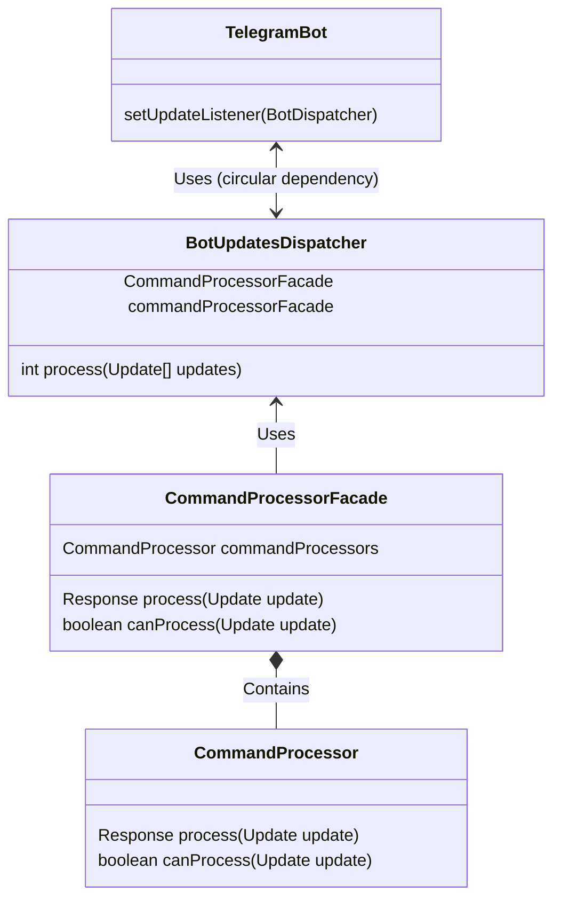

## Bot library

```mermaid
classDiagram

class TelegramBot {
    setUpdateListener(BotDispatcher)
}

TelegramBot <--> BotUpdatesDispatcher : Uses (circular dependency)

class BotUpdatesDispatcher {
    CommandProcessorFacade commandProcessorFacade

    int process(Update[] updates)
}

class CommandProcessorFacade {
  CommandProcessor commandProcessors
  
  Response process(Update update)
  boolean canProcess(Update update)
}

BotUpdatesDispatcher <-- CommandProcessorFacade : Uses

class CommandProcessor {
  Response process(Update update)
  boolean canProcess(Update update)
}

CommandProcessorFacade *-- CommandProcessor : Contains
```
