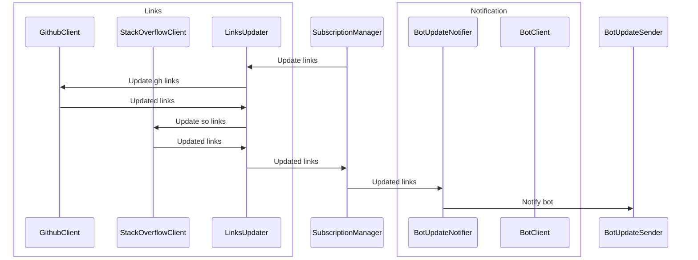

## Link updates

```mermaid

sequenceDiagram

    box Links
    participant GithubClient

    participant StackOverflowClient

    participant LinksUpdater
    end

    participant SubscriptionManager

    box Notification
    participant BotUpdateNotifier
    
    participant BotClient
    end

    SubscriptionManager ->> LinksUpdater: Update links

    LinksUpdater ->> GithubClient: Update gh links
    GithubClient ->> LinksUpdater: Updated links

    LinksUpdater ->> StackOverflowClient: Update so links
    StackOverflowClient ->> LinksUpdater: Updated links

    LinksUpdater ->> SubscriptionManager: Updated links
    
    SubscriptionManager ->> BotUpdateNotifier: Updated links
    
    BotUpdateNotifier ->> BotUpdateSender: Notify bot
```
